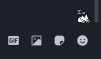

# fluxer-snippets
Welcome! This repo contains a collection CSS snippets for [Fluxer](https://github.com/fluxerapp/fluxer), a FOSS Discord alternative.

# List of snippets
- [transparent theme template](./snippets/transparent-theme-template.css) *by @deeruwu* : simple, customizable theme template with a background image 
  
  

  
- [colorful-titlebar-buttons](./snippets/colorful-titlebar-buttons.css) *by @deeruwu* : modifies the titlebar buttons to be more colorful and have style
  
  

  
- [discord-like-profiles](./snippets/discord-like-profiles.css) *by @deeruwu* : mimics the look of Discord's profiles

  

  
- [dm-fav-icons](./snippets/dm-fav-icons.css) *by @carlfully* : lets you customise the DMs/Main page and Favourite buttons

  

  
- [expanded-css-textarea](./snippets/expanded-css-textarea.css) *by @DeviMorris#1111* : increases the height of the in-app css area, also making it adjustable

  

- [horizontal-serverbar](./snippets/horizontal-serverbar.css) *by @deeruwu* : moves the serverlist to the top of the window in a row

  

- [online-status-as-borders](./snippets/online-status-as-borders.css) *by @deeruwu* : changes the online-status indicators to avatar borders

  

- [server-columns](./snippets/server-columns.css) *by @carlfully & @deeruwu* : makes the server list multi-column! Customizable, but acts weirdly with folders, will try to fix that!

  

- [simple-rounding-multipliers](./snippets/simple-rounding-multipliers.css) *by @deeruwu* : simple setup to control (most) of fluxer's ui rounding strength with a single multiplier

- [oneko](./snippets/oneko.css) *by @AZ#7777* : adds the oneko kitty to your message bar. I might add it to more places later and make a general oneko snippet instead

  

# How to apply
To apply any of the snippets, you can simply copy the text inside the .css file and paste it in Fluxer's settings, more specifically inside `Look & feel > Theme > Custom Theme Tokens > Custom CSS Overrides`. We do this because simply importing with Fluxer's built-in theme sharing will just override anything else you already had, while these snippets are made to be along with your favourite theme!
