# fluxer-snippets
Welcome! This repo contains a collection CSS snippets for [Fluxer](https://github.com/fluxerapp/fluxer), a FOSS Discord alternative.

# List of snippets
- [transparent theme template](./snippets/transparent-theme-template.css) *by @deeruwu* : simple, customizable theme template with a background image 
  
  

  
- [colorful-titlebar-buttons](./snippets/colorful-titlebar-buttons.css) *by @deeruwu* : modifies the titlebar buttons to be more colorful and have style
  
  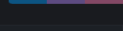

  
- [discord-like-profiles](./snippets/discord-like-profiles.css) *by @deeruwu* : mimics the look of Discord's profiles

  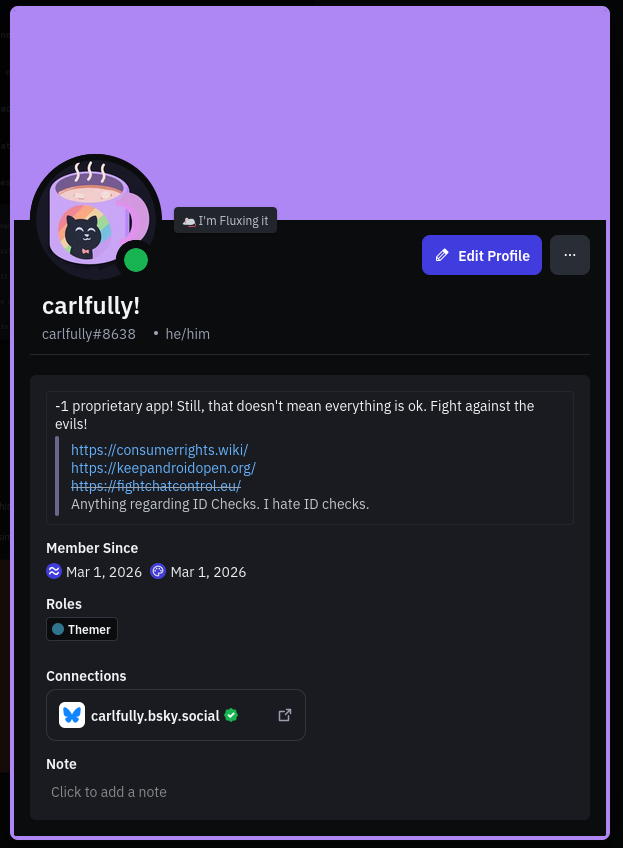

  
- [dm-fav-icons](./snippets/dm-fav-icons.css) *by @carlfully* : lets you customise the DMs/Main page and Favourite buttons

  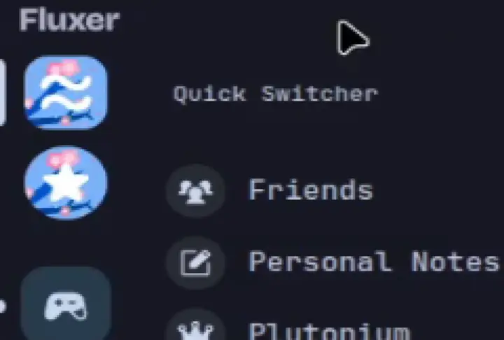

  
- [expanded-css-textarea](./snippets/expanded-css-textarea.css) *by @DeviMorris#1111* : increases the height of the in-app css area, also making it adjustable

  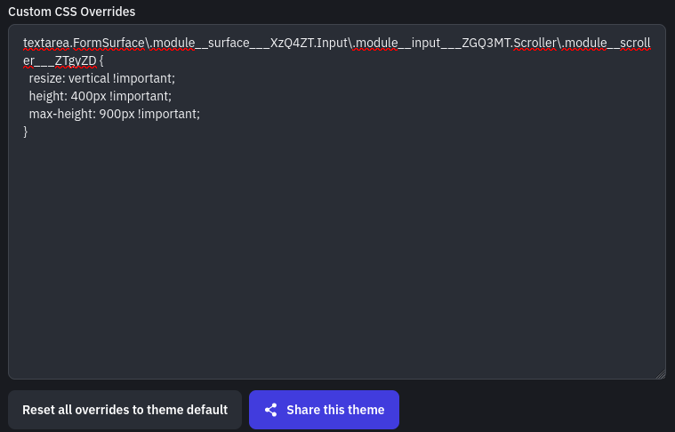

- [horizontal-serverbar](./snippets/horizontal-serverbar.css) *by @deeruwu* : moves the serverlist to the top of the window in a row

  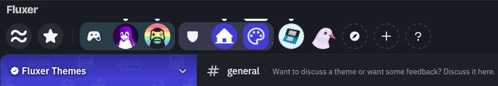

- [online-status-as-borders](./snippets/online-status-as-borders.css) *by @deeruwu* : changes the online-status indicators to avatar borders

  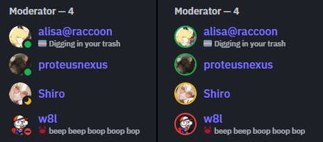

- [server-columns](./snippets/server-columns.css) *by @carlfully & @deeruwu* : makes the server list multi-column! Customizable, but acts weirdly with folders, will try to fix that!

  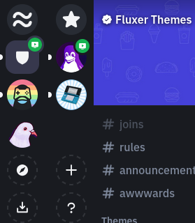

- [simple-rounding-multipliers](./snippets/simple-rounding-multipliers.css) *by @deeruwu* : simple setup to control (most) of fluxer's ui rounding strength with a single multiplier

- [oneko](./snippets/oneko.css) *by @AZ#7777* : adds the oneko kitty to your message bar. I might add it to more places later and make a general oneko snippet instead

  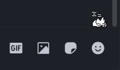

- [ImproveUserArea](https://github.com/GH0STP4WZ/Fluxer-CSS-Snippets/blob/main/Snippets/CSS/ImprovedUserArea.css) *by @GH0STP4WZ#0001* : enhances the user area by hiding the Voice Call buttons and showing you more information

  

- [Usernameplates](https://github.com/GH0STP4WZ/Fluxer-CSS-Snippets/blob/main/Snippets/CSS/UserNamePlates.css) *by @GH0STP4WZ#0001* : a small redesign of Usernames in message headers to give them a little extra flair. Role Color Agnostic, Should work with any role color. Name Legibility with darker role colors on dark mode, or lighter role colors on light mode is not guaranteed.

  
  

- [Compact Memberlist](https://github.com/GH0STP4WZ/Fluxer-CSS-Snippets/blob/main/Snippets/MDs/Compact%20Members%20List.md) *by @GH0STP4WZ#0001* : Fluxer on a Small Screen can be annoying. This snippet hides the Members List until you hover over it, giving you more space to view messages.

  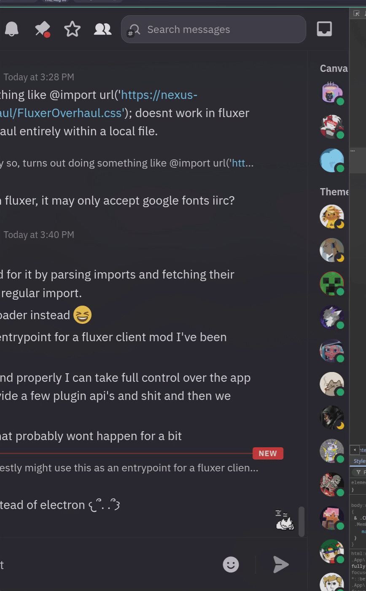

- [Better Bot tags](./snippets/better-bottags.css) *by @GH0STP4WZ#0001* : If a bot message is a webhook, show it as a webhook.

  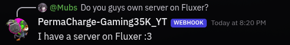

- [Enhanced Callouts](https://github.com/GH0STP4WZ/Fluxer-CSS-Snippets/blob/main/Snippets/MDs/Enhanced%20Alert%20Blocks.md) *by @GH0STP4WZ#0001* : More Stylized callouts which stand out a bit more. Has 3 variants!

  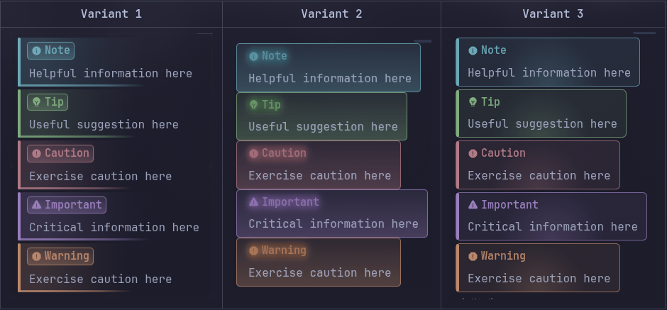

- [Iconify Search](https://github.com/GH0STP4WZ/Fluxer-CSS-Snippets/blob/main/Snippets/MDs/Iconify%20Search.md) *by @GH0STP4WZ#0001* : Collapses the search bar in the Channel header into an icon that matches the style of the other buttons, allowing it to take up less space and expand when needed.

  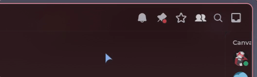

# How to apply
To apply any of the snippets, you can simply copy the text inside the .css file and paste it in Fluxer's settings, more specifically inside `Look & feel > Theme > Custom Theme Tokens > Custom CSS Overrides`. We do this because simply importing with Fluxer's built-in theme sharing will just override anything else you already had, while these snippets are made to be along with your favourite theme!
